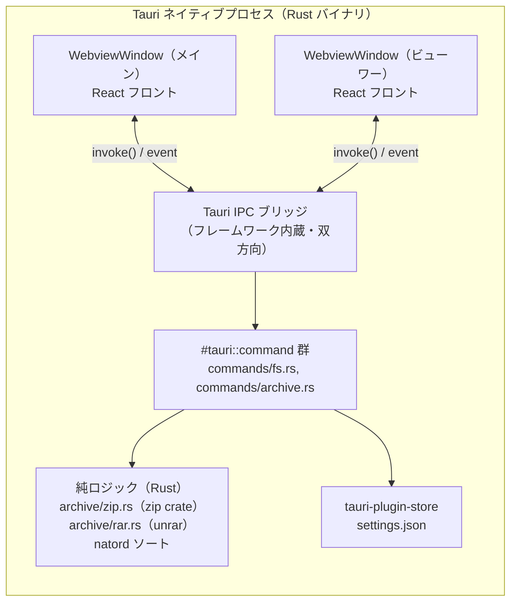
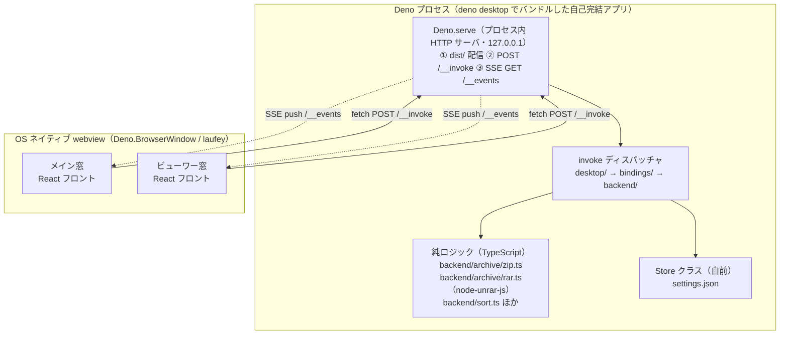
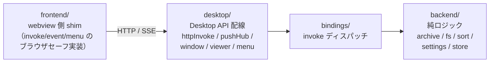

# Tauri → Deno Desktop 構造移行の設計変更

mekuri のバックエンド基盤を **Tauri v2（Rust コアプロセス）** から **Deno Desktop
（`Deno.BrowserWindow` + Deno プロセス）** へ移行した。本書はその**構造的な設計変更**を、
実装を知らない人にも説明できるようにまとめたもの。

## 一言で言うと

> **Tauri がフレームワークとして内蔵していた「ネイティブ IPC ブリッジ」を捨て、Deno
> プロセスの中に立てた自前の HTTP サーバ（リクエスト/レスポンス＝`POST /__invoke`、
> サーバ→画面の push＝SSE `GET /__events`）で webview ↔ バックエンドを繋ぎ直した。**

フロント（React）・コマンド名・画像の渡し方（Base64 data URL）は変えていない。
**変わったのは「webview とネイティブ側をどう繋ぐか」という配管の部分**である。

---

## 1. 全体構成: Before / After

### Before（Tauri v2）



- webview もネイティブも **1 つの Tauri プロセス**に同居。
- 繋ぎは **Tauri が提供する IPC ブリッジ**。フロントは `invoke(command, args)` を呼ぶだけで、
  フレームワークが対応する `#[tauri::command]` へ配送する（双方向、イベントも同経路）。

### After（Deno Desktop）



- ネイティブ側は **Deno プロセス**。`deno desktop main.ts` が main.ts をコンパイルして
  dist を埋め込んだ**自己完結アプリ**にする。
- webview は **OS ネイティブ webview**（`Deno.BrowserWindow`）。Deno が起動時に初期窓を開き、
  自動で `Deno.serve` のアドレス（127.0.0.1）へ遷移する。
- 繋ぎは **Deno プロセス内に立てた HTTP サーバ**。webview からは `fetch` で叩く。

---

## 2. 設計変更の核心: IPC トランスポート

ここが今回いちばん大きい構造変更。

### Before: フレームワーク内蔵の双方向ブリッジ

```
webview                    Tauri プロセス
  invoke("read_dir", {..}) ──IPC──▶ #tauri::command read_dir(..)
                           ◀─戻り値─
  listen("event")          ◀─emit── window.emit("event", ..)
```

`invoke` と `event` の両方を **Tauri が用意した IPC レイヤ**が運ぶ。開発者は配管を書かない。

### After: 自前の HTTP（要求/応答）＋ SSE（push）

```
webview                          Deno プロセス（Deno.serve）
  fetch POST /__invoke           ──HTTP──▶ handleInvokeRequest → dispatch
    {command, args, windowLabel} ◀─JSON──   {ok, value|error}

  new EventSource("/__events?    ──SSE──▶  PushHub に登録
       windowLabel=..")          ◀─push──   イベント/メニュークリックを配送
```

- **要求/応答**（フォルダ走査・画像取得・設定の読み書き・窓操作・メニュー）は
  `POST /__invoke` の 1 本に集約。body は `{command, args, windowLabel}`、戻りは `{ok, value|error}`。
- **サーバ→画面の push**（窓をまたぐイベント、ネイティブメニューのクリック結果）は
  **SSE `GET /__events`** で配送する。

### なぜブリッジをやめて HTTP にしたのか（重要な判断理由）

Deno Desktop（canary）の `win.bind("invoke", ..)` / `win.executeJs(..)` は、
**起動時に framework が自動で開く「表示窓」に届かない**ことが計測で確定した
（`new Deno.BrowserWindow()` で得たオブジェクトと、実際に表示されている窓が別物）。
これが「白画面 / `No callback bound for: invoke`」の真因。

→ **HTTP / SSE は特定の窓オブジェクトに依存しない**（webview から見れば普通のネットワーク
通信）。どの窓からでも確実に届くため、この採用バグを構造的に回避できる。リファレンス実装
（denidian）も同じく `win.bind` を使わず HTTP transport を採用している。

> 「どの窓からの呼びか」が要る window/menu 系コマンドは、webview が**自窓のラベル**を
> リクエストに載せ、main 側が `label → 窓` を解決して処理する。

---

## 3. レイヤ構成（Deno 側）

トランスポートを差し替えても**ロジックは Desktop API 非依存に保ち単体テスト可能**にする、
という方針は Tauri 版（`commands/` と `archive/` の分離）から引き継いでいる。



| レイヤ | 役割 | Tauri 版の対応 |
|---|---|---|
| `frontend/` | webview に置く Tauri 互換 `invoke`/`event` shim（`backend` を import しない） | `@tauri-apps/api`（フレームワーク提供） |
| `desktop/` | `Deno.serve`・`Deno.BrowserWindow` への配線（HTTP/SSE/窓/メニュー） | `commands/`（IPC エンドポイント） |
| `bindings/` | コマンド名→backend のディスパッチ | `commands/mod.rs` のルーティング |
| `backend/` | アーカイブ展開・FS・ソート等の純ロジック（Desktop 非依存・テスト可能） | `archive/`（Tauri 非依存の純ロジック） |

`main.ts` は「Desktop API への配線のみ」を担い、ロジックは持たない（薄い配線層）。

---

## 4. 対応表（何が何に変わったか）

| 関心事 | Tauri v2（Before） | Deno Desktop（After） |
|---|---|---|
| ネイティブプロセス | Rust バイナリ | Deno（TypeScript）プロセス |
| 配布形態 | `tauri build` | `deno desktop`（main.ts をコンパイル＋dist 埋め込み） |
| 窓 | `WebviewWindow` | `Deno.BrowserWindow`（OS ネイティブ webview） |
| **要求/応答 IPC** | **`invoke()` → IPC ブリッジ → `#[tauri::command]`** | **`fetch POST /__invoke` → `Deno.serve` → dispatch** |
| **push（main→画面）** | **Tauri イベント（`emit`/`listen`）** | **SSE `GET /__events`（PushHub）** |
| フロント配信 | Tauri のアセットプロトコル | `Deno.serve` で `dist/` を HTTP 配信（127.0.0.1） |
| ZIP/CBZ 展開 | `zip` crate（Rust） | TypeScript 実装（`backend/archive/zip.ts`） |
| RAR/CBR 展開 | `unrar`（Rust） | `node-unrar-js`（`backend/archive/rar.ts`） |
| 自然順ソート | `natord` crate | `backend/sort.ts` |
| 設定永続化 | `tauri-plugin-store` | 自前 `Store` クラス → `settings.json` |
| 画像転送 | Base64 data URL | Base64 data URL（**不変**） |
| 二重オープン防止 | window label レジストリ | window label レジストリ（**不変**） |

---

## 5. 変えなかったもの（移行の境界）

- **React フロント**（`src/`）はほぼそのまま。`src/api/*.ts` の `invoke` import 先を
  Tauri 互換 shim（`frontend/invoke.ts`）に差し替えるだけで、**コマンド名・引数は不変**。
- 見開き表示・読み方向・PDF レンダリング等の**アプリ仕様は不変**。
- 「IPC 層は薄く、ロジックは依存ゼロで単体テスト」という**設計原則も不変**。

つまり今回の移行は **「アプリの作り」ではなく「webview とネイティブを繋ぐ配管」の付け替え**
であり、その配管がフレームワーク内蔵の IPC から「プロセス内 HTTP サーバ」へ変わった、
というのが構造的な設計変更の本質である。
